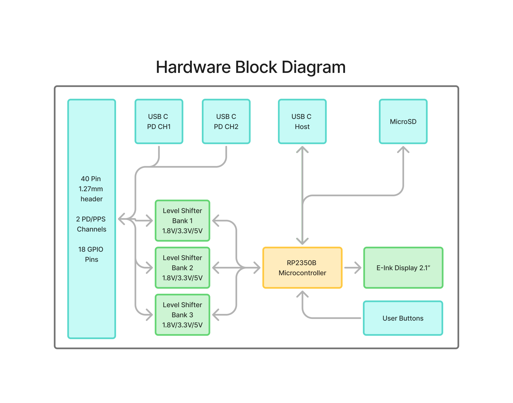

# LogicWeave

*A programmable test system for versatile hardware validation and testing.*

**LogicWeave** is a powerful and flexible hardware platform designed for engineers, hobbyists, and developers who need a comprehensive tool for testing and validating electronic circuits and systems. At its core is the **RP2350B** microcontroller, providing robust performance and a wide range of features, all controllable through a user-friendly Python library.

---

## Hardware Overview

- **Microcontroller**: Raspberry Pi RP2350B for significant processing power.
- **Dual USB-C PD/PPS Channels**: Independent USB Type-C ports support Power Delivery (PD) and Programmable Power Supply (PPS).
- **USB-C Host Connection**: Seamless USB-C connection to a host computer.
- **MicroSD Card Slot**: Onboard storage for logs, configurations, or firmware updates.
- **E-ink Display**: Low-power display for real-time feedback or UI.
- **User Buttons**: For manual control or triggering test sequences.
- **40-Pin Connector**: Standardized I/O breakout for interfacing with DUTs.

---

## Features

- **Flexible GPIO**: 18 level-shifted GPIOs across 3 banks, each configurable to 1.8V, 3.3V, or 5V.
- **Rich Peripheral Support**: SPI, I2C, UART, PWM—all multiplexed across available pins.
- **Python Control Library**: High-level API for full hardware control.
- **Protocol Buffers Interface**: Robust communication using protobuf.

---

## GPIO Pinout

| GPIO | SPI        | I2C       | PWM     | UART       | IO Bank |
|------|------------|-----------|---------|------------|---------|
| 30   | SPI1 SCK   | I2C1 SDA  | PWM7 A  | UART0 CTS  | 1       |
| 31   | SPI1 TX    | I2C1 SCL  | PWM7 B  | UART0 RTS  | 1       |
| 32   | SPI0 RX    | I2C0 SDA  | PWM8 A  | UART0 TX   | 1       |
| 33   | SPI0 CSn   | I2C0 SCL  | PWM8 B  | UART0 RX   | 1       |
| 34   | SPI0 SCK   | I2C1 SDA  | PWM9 A  | UART0 CTS  | 1       |
| 35   | SPI0 TX    | I2C1 SCL  | PWM9 B  | UART0 RTS  | 1       |
| 36   | SPI0 RX    | I2C0 SDA  | PWM10 A | UART1 TX   | 1       |
| 37   | SPI0 CSn   | I2C0 SCL  | PWM10 B | UART1 RX   | 2       |
| 38   | SPI0 SCK   | I2C1 SDA  | PWM11 A | UART1 CTS  | 2       |
| 39   | SPI0 TX    | I2C1 SCL  | PWM11 B | UART1 RTS  | 2       |
| 40   | SPI1 RX    | I2C0 SDA  | PWM8 A  | UART1 TX   | 2       |
| 41   | SPI1 CSn   | I2C0 SCL  | PWM8 B  | UART1 RX   | 3       |
| 42   | SPI1 SCK   | I2C1 SDA  | PWM9 A  | UART1 CTS  | 3       |
| 43   | SPI1 TX    | I2C1 SCL  | PWM9 B  | UART1 RTS  | 3       |
| 44   | SPI1 RX    | I2C0 SDA  | PWM10 A | UART0 TX   | 3       |
| 45   | SPI1 CSn   | I2C0 SCL  | PWM10 B | UART0 RX   | 3       |
| 46   | SPI1 SCK   | I2C1 SDA  | PWM11 A | UART0 CTS  | 3       |
| 47   | SPI1 TX    | I2C1 SCL  | PWM11 B | UART0 RTS  | 3       |

---

## Interfacing and Development

An example **KiCad project** is included to help you design custom interface boards for the 40-pin header—ideal for creating tailored DUT test fixtures.

---

## Getting Started 

### Installation

```bash
pip install logicweave
```

### Basic Connection

Connect LogicWeave via the **USB-C host port**. It will appear as a serial device.

```python
from LogicWeave import LogicWeave

with LogicWeave() as lw:
    print("Successfully connected to LogicWeave!")
    firmware_info = lw.read_firmware_info()
    print(f"Firmware Version: {firmware_info.version}")
```

---

## API Usage Examples

### GPIO Control

```python
from LogicWeave import LogicWeave, GPIOMode
import time

with LogicWeave() as lw:
    led_pin = lw.gpio(30)
    led_pin.set_mode(GPIOMode.OUTPUT)
    led_pin.write(True)
    time.sleep(1)
    led_pin.write(False)
```

### I2C Communication

```python
from LogicWeave import LogicWeave

with LogicWeave() as lw:
    i2c_bus = lw.i2c(instance_num=0, sda_pin=32, scl_pin=33)
    i2c_bus.write(0x27, b'\xDE\xAD\xBE\xEF')
    data = i2c_bus.read(0x27, 4)
    print(f"Read from I2C: {data.hex()}")
```

### SPI Communication

```python
from LogicWeave import LogicWeave

with LogicWeave() as lw:
    spi_bus = lw.spi(
        instance_num=0,
        sclk_pin=34,
        mosi_pin=35,
        miso_pin=32,
        baud_rate=1000000,
        default_cs_pin=33
    )
    spi_bus.write(b'\x01\x02\x03')
    read_data = spi_bus.read(byte_count=4, data_to_send=0xFF)
    print(f"Read from SPI: {read_data.hex()}")
```

### USB-C Power Delivery Control

```python
from LogicWeave import LogicWeave

with LogicWeave() as lw:
    lw.write_pd_output_state(channel=0, on=True)
    lw.write_pd_power_request(channel=0, voltage_mv=9000, current_limit_ma=1500)
    status = lw.read_pd_channel_status(channel=0)
    print(f"Channel 0: {status.voltage_mv}mV, {status.current_ma}mA")
```

### E-ink Display

```python
from LogicWeave import LogicWeave

with LogicWeave() as lw:
    lw.write_clear_screen()
    lw.write_text("Hello, LogicWeave!", x=10, y=20)
    lw.write_refresh_screen()
```

### GPIO Bank Voltage

```python
from LogicWeave import LogicWeave, BankVoltage

with LogicWeave() as lw:
    lw.write_bank_voltage(bank=1, voltage=BankVoltage.V5)
```

---

## License

This project is licensed under the **MIT License**. See `LICENSE.md` for full details.
